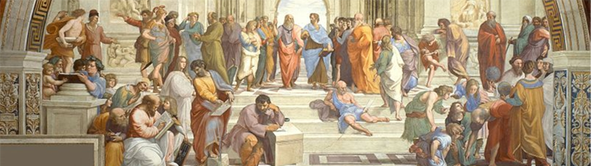
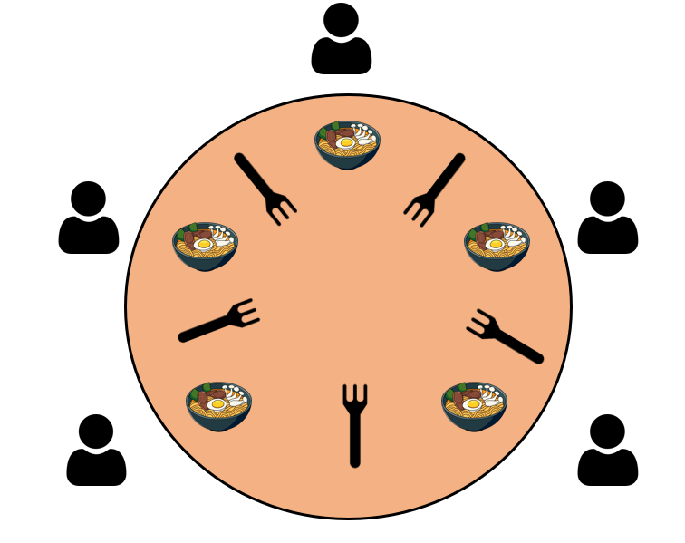
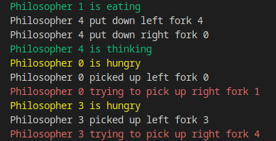

# Dining Philosophers Problem



For full detail explanation, please refer to our [document1](Slide_and_Report/OS_Project_Report.pdf), [document2](Slide_and_Report/Dining_Philosopher_Solution_1_to_6.pdf).

# Introduction

Concurrency and synchronization are crucial in computer science, especially in operating systems and distributed computing. The **Dining Philosophers Problem**, introduced by **Edsger Dijkstra** in **1965**, is a classic example used to illustrate the challenges of managing shared resources in concurrent systems, avoiding deadlock and starvation.

This problem is widely used to understand synchronization techniques and evaluate strategies for deadlock prevention. Its principles are relevant in areas like database systems, distributed computing, and networking. In this project, we focuse on the theoretical underpinnings of the problem and examines various strategies to address its challenges.

## Problem Statement



The Dining Philosophers Problem illustrates a scenario where five philosophers sit around a circular table. Each philosopher has their own place at the table. There is a fork between each plate. The dish served is a kind of spaghetti which has to be eaten with two forks. Each philosophe continuous alternating between two activities: **thinking** and **eating**. To eat, a philosopher needs two forks, one on the left and one on the right.

### States:
- **Thinking**: The philosopher simply sits and does nothing.
- **Eating**: To eat, a philosopher needs to pick up two forks, one at a time. He takes the fork on the left hand side first, then the right ones. Only when he can obtain both forks, he can start to eat.

### Process when a philosopher wants to eat:
1. Try to pick up the left fork.
2. If the left fork is available, try to pick up the right fork. (During the waiting time for the right fork, the philosopher DOES NOT put down the left fork he has already picked up)
3. If both forks are acquired, start eating.
4. After eating, put down the right fork, then the left fork.

The challenge is to design an algorithm ensuring no philosopher starves, even under varying conditions. However, some of the solutions we propose below may slightly relax one or more of these constraints to improve synchronization flexibility and efficiency.


## Challenges

The primary challenge is ensuring all philosophers can eat without encountering issues such as:

- 🚫 **Deadlock**: Occurs when all philosophers hold one fork and wait indefinitely for the other, creating a circular dependency.

- 🔄 **Livelock**: Philosophers keep picking up and putting down forks without making progress, stuck in a repetitive cycle.

- ⏳ **Starvation**: One or more philosophers are unable to eat because others monopolize the forks, leading to unfair resource allocation.

## Solutions Overview

We propose several solutions to the Dining Philosophers Problem, each with its own trade-offs and synchronization strategies. 

- Resource hierarchy
- Limit number of dinners
- Chandy/Misra
- Each fork is a semaphore (Solution 1)
- Each fork is a semaphore, but only one philosopher can pick up forks at a time (Solution 2)
- Even-numbered philosophers pick up the left fork first and vice versa (Solution 3)
- Return left fork if right fork is not available (Solution 4)
- Simultaneous semaphore (Solution 5)
- Monitor (Solution 6)

*Details explain for the  Resource hierarchy, limit number of dinners and Chandy/Misra can be found in our [document1](Slide_and_Report/OS_Project_Report.pdf) while solutions from 1 - 6 can be found in  [document2](Slide_and_Report/Dining_Philosopher_Solution_1_to_6.pdf)*


# 🚀 Run the code

First, navigate to the directory where the code is located.

```bash
cd SourceCode
```

To complie the code, run the following command in the terminal:

```bash
g++ -pthread  replace_with_file_name.cpp -o replace_with_output_name
```

To run the code, run:

```bash
./replace_with_output_name
```

The output when running the code will be the sequence of actions of each philosopher, each kind of action is outputted in a different color. For 
example, the output will look something like this:


